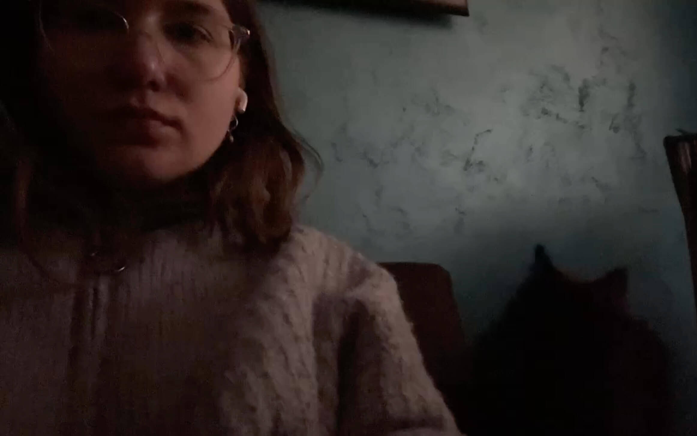

# Anastasiia Nikonova



## Contacts

* discord: anastasiya#5684 / Anastasiia (@anastanei)
* [anastaney@gmail.com](mailto:anastaney@gmail.com)

## About

I first encountered programming during my school and university studies, but afterward, I worked in completely different fields. A couple of years ago, I had the chance to try my hand at web development, and now I’m looking to learn more about quality coding. The structure and logic behind code appeal to me, and I enjoy the learning process, especially in the supportive atmosphere at RS School.

Finding a job one day would help cover my cat's plane tickets and vet bills, but maintaining realistic expectations is essential, so I’m focusing on studying as much as I can for now.

## Skills

* JavaScript, HTML, CSS, SASS, BEM, Tailwind
* Git, Bash, Figma
* Agile, ClickUp, Jira

## Code example

[Bit counting](https://www.codewars.com/kata/526571aae218b8ee490006f4)

The function countBits takes a non-negative integer n as input and returns the number of 1 bits in its binary representation. For example, for the input 1234, which is represented as 10011010010 in binary, the function returns 5 because there are five 1 bits.

```javascript
const countBits = (n) => n.toString(2).split('0').join('').length;
```

## Experience (educational projects)

* **Shelter** - JS Pre-school landing, JS + HTML + SASS  
  [Code](https://github.com/anastanei/shelter) | [Demo](https://anastanei.github.io/shelter/shelter/index.html)
* **Finding Binya** - Minesweeper game, JS + HTML + Tailwind + SASS  
  [Code](https://github.com/anastanei/finding-binya) | [Demo](https://anastanei.github.io/finding-binya/random-game/)

## Education

### RS School

[JS / Front-end Pre-school - 2024](https://rs.school/courses/javascript-preschool-ru)

### Petrozavodsk State University

**Professional Development Courses**:  
*Management in an Innovative Economy. Socio-Economic Project Planning*  
*2016 - 2017*

### Petrozavodsk State University

**Bachelor of Information Technology**  
*Pursued from 2012 - 2015*

## Languages

* **Russian**: Native
* **English** : Intermediate
* **Serbian**: Basic
